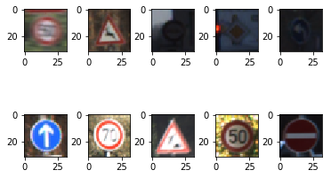
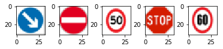

# Self-Driving Car Engineer Nanodegree

## Deep Learning: Build a Traffic Sign Recognition Classifier

The goals / steps of this project are the following:
* Load the data set (see below for links to the project data set)
* Explore, summarize and visualize the data set
* Design, train and test a model architecture
* Use the model to make predictions on new images
* Analyze the softmax probabilities of the new images
* Summarize the results

---
## Step 0: Load The Data

 Load German traffic data from using pickle library.

---

## Step 1: Dataset Summary & Exploration

The pickled data is a dictionary with 4 key/value pairs:

- `'features'` is a 4D array containing raw pixel data of the traffic sign images, (num examples, width, height, channels).
- `'labels'` is a 1D array containing the label/class id of the traffic sign. The file `signnames.csv` contains id -> name mappings for each id.
- `'sizes'` is a list containing tuples, (width, height) representing the original width and height the image.
- `'coords'` is a list containing tuples, (x1, y1, x2, y2) representing coordinates of a bounding box around the sign in the image.

```

    Number of training examples = (34799, 32, 32, 3)
    Number of testing examples = 12630
    Image data shape = (32, 32, 3)
    Number of classes = 43
```




----

## Step 2: Design and Test a Model Architecture

Design and implement a deep learning model (LeNet-5) that learns to recognize traffic signs. Train and test your model on the [German Traffic Sign Dataset](http://benchmark.ini.rub.de/?section=gtsrb&subsection=dataset).


### Pre-process the Data Set (normalization, grayscale, etc.)
I tried grayscale and mean zeros and equal variance for preprocessing. For the grayscale conversion I added the along color channels. Since the results were not any better, i excluded it from final calculation. However code for grayscale is available in the notebook code. The image data was normalized so that it has mean zero and equal variance. To normalize the image data, I used `(pixel - 128)/ 128`. Also, randomly shuffled data for better results .

### Model Architecture

My final model consisted of the following layers:

| Layer         		|     Description	        					| Output        |
|:---------------------:|:---------------------------------------------:|
| Input         		|  RGB image   							|      32x32x3          |
| Convolution Layer 1 5x5x3     	| 1x1 stride, valid padding| 28x28x16 	|
| RELU					|												|                         |
| Max pooling	      	| 2x2 stride |   14x14x16				|
| Convolution Layer 2 5x5x3	    | 1x1 stride, valid padding| 10x10x16     |
| RELU					|												|                         |
| Max pooling	      	| 2x2 stride |   5x5x16				|
| Fully connected	1	| 400        		|  120							|
| RELU					|												|                         |
| Fully connected	2	| 120        		|  84							|
| RELU					|												|                         |
| Fully connected	3	| 84        		|  43						|


### Train, Validate and Test the Model

A validation set can be used to assess how well the model is performing. A low accuracy on the training and validation
sets imply underfitting. A high accuracy on the training set but low accuracy on the validation set implies overfitting.


### Train your model here.

# Train pipeline
Learning rate = 0.001,
EPOCHS = 30
BATCH_SIZE = 64
I used Adam optimizer.

The above architecture with these pipelines gave and accuracy of little over 93% on validation dataset.  I started with LeNet architecture that was used in the digit recognition  example. I tried following few modifications before using final architecture:

- I tested this architecture for both using color images (all 3 channels) as well as grayscale version of color images (code for grayscale version is in comments). The results for color images were better than for grayscale images, so I decided to use color images.  

- I normalized images by subtracting and dividing every pixel by 128. This help in making images zero mean and unit variance.

- I played with EPOCHS values of 10 - 40 and I got best results for 30.

- For BATCH_SIZE, I trained the model for 32 - 150 and found that 64 gave the best results.

- For learning rate, I tried a range of values of 0.0009 and 0.001. 0.01 gave better result.

I want to mention that, I didn't have much problem in achieving a result of 93.1%. I would like to learn more structured approaches for hyper-parameters optimization.

---

## Step 3: Test a Model on New Images

To get more insight into how our model is working, I downloaded five pictures of traffic signs from the web and use your model to predict the traffic sign type.

### Load and Output the Images





### Predict the Sign Type for Each Image

Run the predictions here and use the model to output the prediction for each image.

```

    Predicted class labels: [38 17  2 14  3]

```

### Analyze Performance

Calculate the accuracy for these 5 new images.

```
    Actual labels: [38, 17, 2, 14, 3]
    Predicted class labels: [38 17  2 14  3]
    Test Accuracy = 1.000
```

 The most likely reason for 100% could be these test images from web are similar to the ones found in the original German dataset. It will interesting to see how model performs for more diverse images.

Output Top 5 Softmax Probabilities For Each Image Found on the Web

For each of the new images, he model's softmax probabilities to show the **certainty** of the model's predictions are as follows:

```

    [[  1.0000e+00   0.0000e+00   0.0000e+00   0.0000e+00   0.0000e+00]
     [  1.0000e+00   1.5641e-09   2.5385e-17   4.3076e-20   6.8900e-21]
     [  1.0000e+00   1.0880e-15   7.8485e-16   8.6057e-19   1.4345e-19]
     [  5.4998e-01   4.5002e-01   2.2766e-08   2.5579e-12   2.0644e-12]
     [  9.4316e-01   5.6839e-02   3.9206e-09   4.6434e-10   3.7211e-17]]

```

 The softmax probabilities for 4 classes are almost to 1. As pointed earlier, this could be because of similarity of web test images to the original German traffic signs dataset. for class 14 (Stop sign), the probability is just over 0.5. It will be interesting to test the model for more diverse set of images.

---
